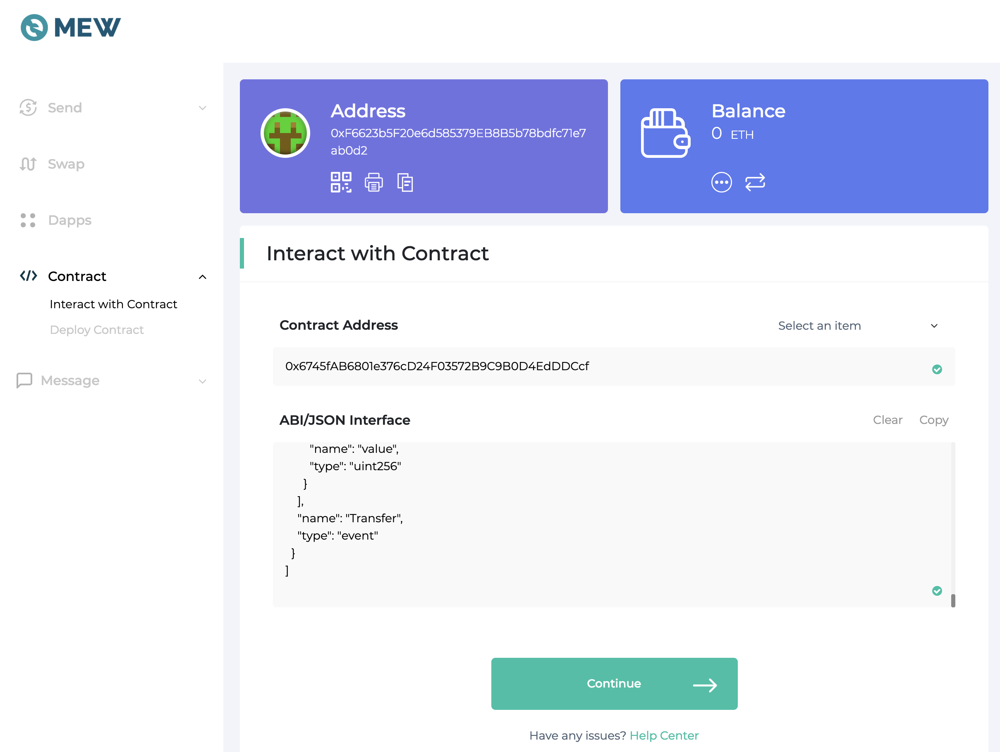
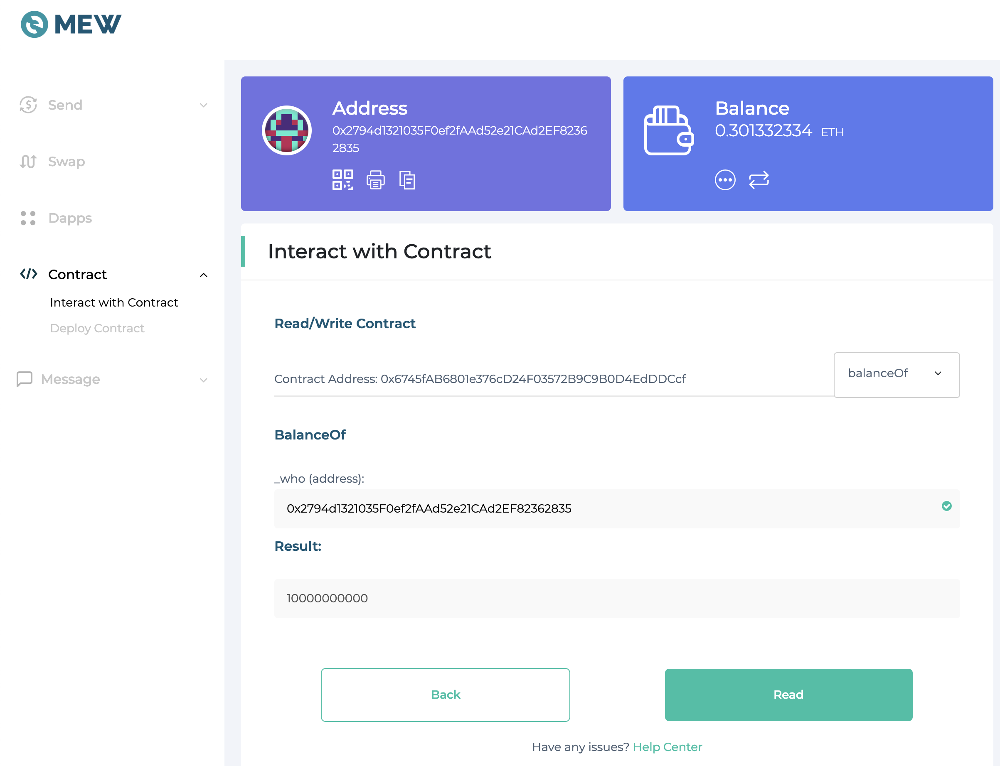
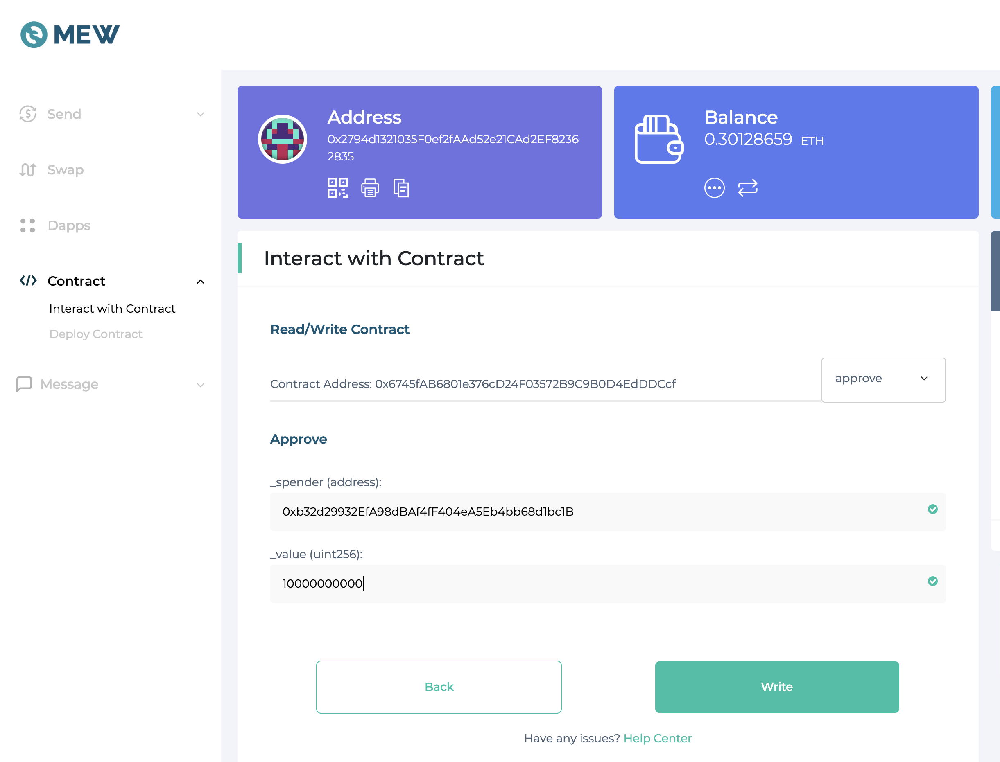
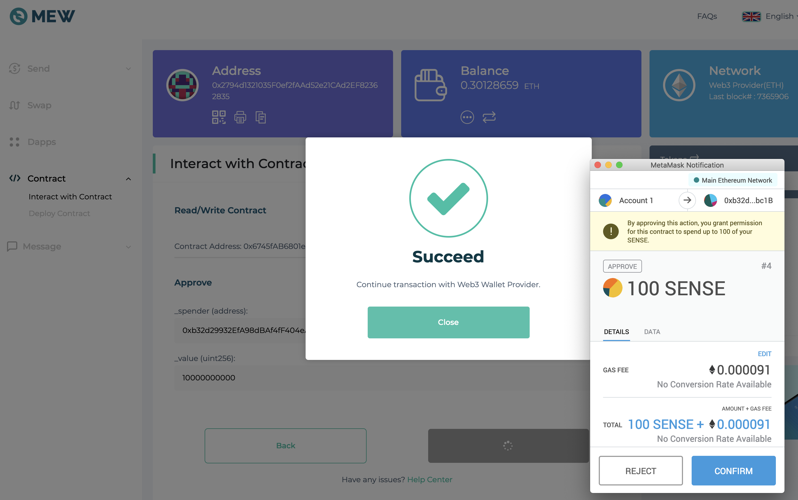
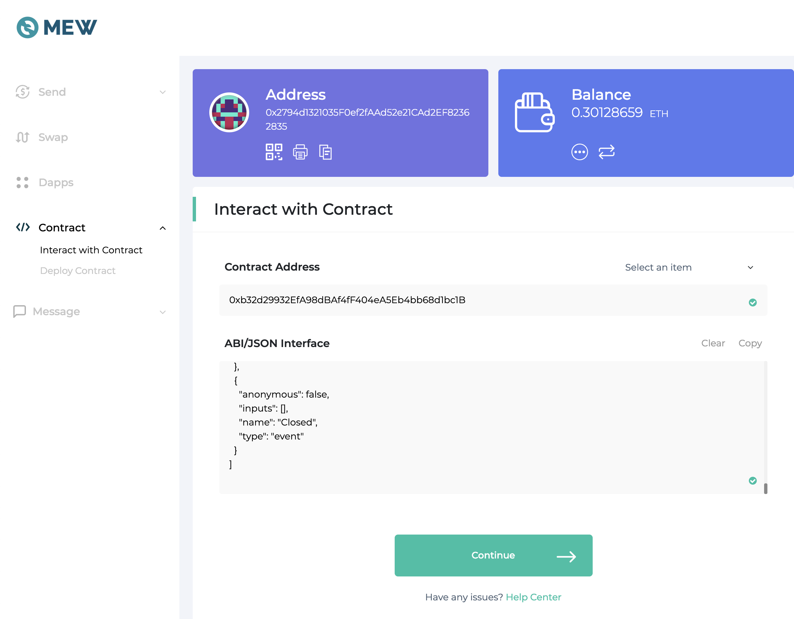
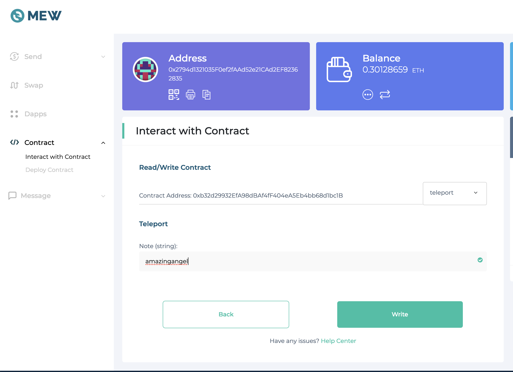

# Documentation and information about Sense.Chat and the SENSE token.

## If you want to teleport your SENSE ERC-20 tokens to SENSE EOS-21 tokens, then load your ethereum account into metamask and follow this simple site we built. https://sensetoken.com

## Instructions for manual token teleportation

### Recommendation
Please check https://ethgasstation.info/ for the "Fast" GWEI cost and use that as your GWEI setting on all ETH transactions so there is less chance your ETH transactions will fail.

### Step 1 - Approve Teleportation
Access your wallet via MyEtherWallet. Select method (i.e. Ledger, Metamask, etc) and then make your window really wide so you can see the menu on the left, click the "CONTRACT" menu listed as the 5th item on the list below "DASHBOARD." This is all shown in the first image below.

Select "Interact with contract" and enter the following SENSE ERC20 token address: `0x6745fAB6801e376cD24F03572B9C9B0D4EdDDCcf`.

Under ABI/JSON section, copy/paste the contents of the [SENSE ERC20 CONTRACT ABI](senseToken.abi) and select "Continue".

Under the "Read/Write Contract" section, select the dropdown on the right "Select an Item". These are the contract functions.

First check the SENSE ERC20 balance of your account. Select `balanceOf` from the dropdown. Under `_who (address)` enter your current ETH address (which holds your SENSE ERC20 tokens). Click "Read". Copy that value. It's the amount of SENSE you have as ethereum registers it with the added 0s (8 of them).

Switch the dropdown now to the `approve` function. Paste in the value you copied in the step before to the `_value` field. Under spender, paste in the migration contract address: `0x39c47198359c0a20dd8170ec7638b06505d4d073`. Click "Write". This will trigger you approving the transaction. Approve it and wait for it to confirm. Check the blinking red notification on the top right to confirm a successful transaction.

### Step 2 - Teleport 🚀
Refresh the page and re-select how to access your wallet, and head to the same "Contract" section again.

For the "Contract address" this time paste in the migration contract address: `0x39c47198359c0a20dd8170ec7638b06505d4d073`. Copy/paste the contents of the [MIGRATION CONTRACT ABI](migration.abi) and select "Continue".

On the dropdown select the `teleport` function. For `Note (string)` enter the EOS account you want your SENSE EOS tokens delivered. *DOUBLE-CHECK THIS ADDRESS* By doing this manually we can't confirm this for you. The oracle will deliver to the address you input here. Once you have confirmed the address, click "Write".

Approve the transaction. Teleportation is now manually trigggered. Once you notify us about your teleportation, your EOS tokens will be delivered ⚡ 🚀.

### Step 3 - NOTIFY US - Please email ben@makesense.com with the ETH transaction details. 

### Step 4 - ENJOY SENSE on EOS
